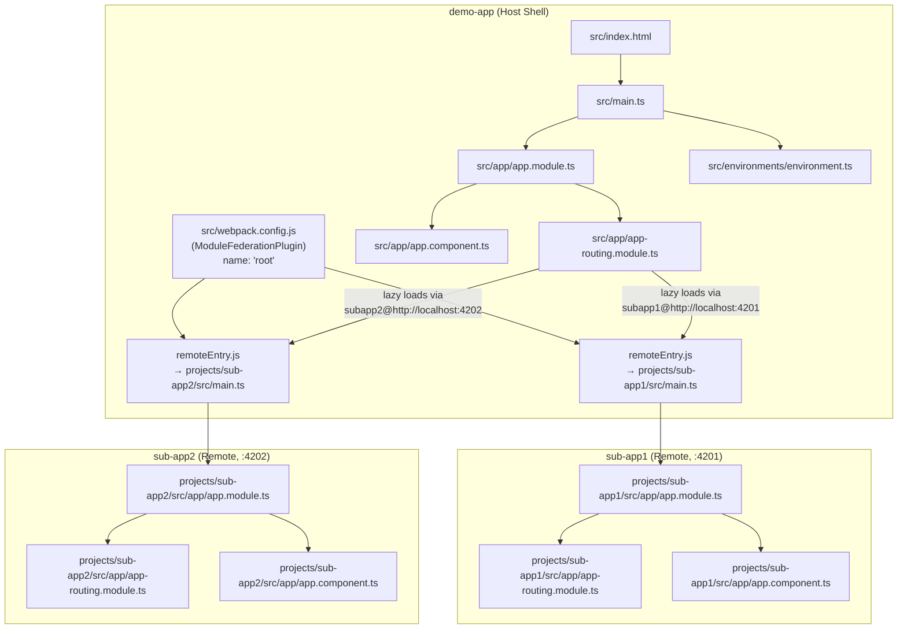
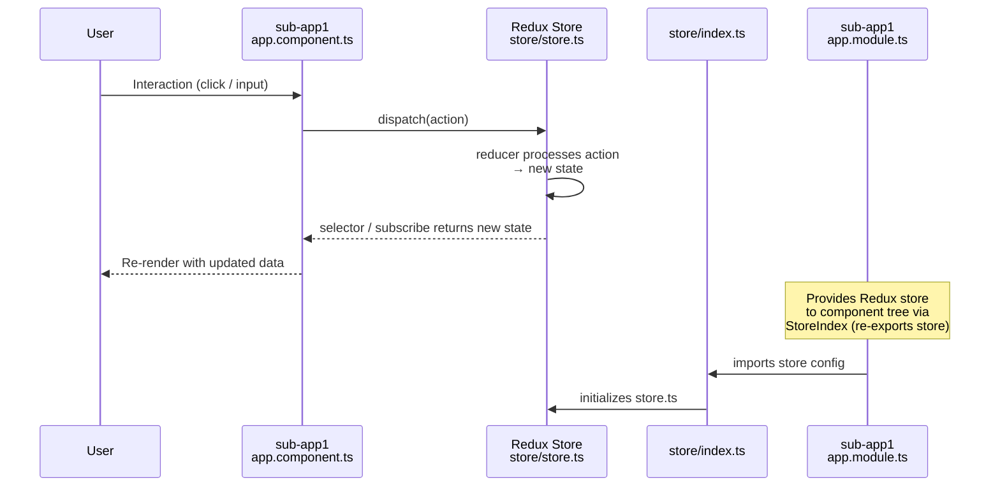
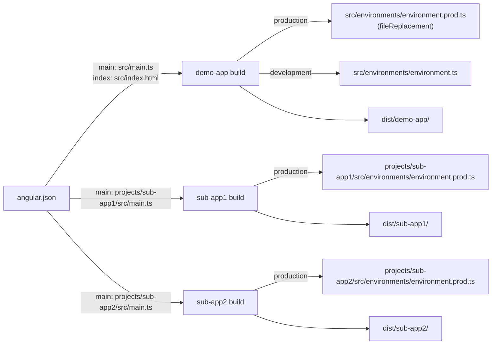

# Architecture Overview

This workspace is an **Angular 14 micro-frontend** application using **Webpack Module Federation**. It consists of one host shell (`demo-app`) and two remote applications (`sub-app1`, `sub-app2`).

---

## Project Structure Map

| Conceptual Role | Project Name | Root Path |
|---|---|---|
| Host / Shell | `demo-app` | `src/` |
| Remote 1 | `sub-app1` | `projects/sub-app1/` |
| Remote 2 | `sub-app2` | `projects/sub-app2/` |

### Key File Paths

| Artifact | File Path |
|---|---|
| Workspace config | `angular.json` |
| Host bootstrap | `src/main.ts` |
| Host root module | `src/app/app.module.ts` |
| Host router | `src/app/app-routing.module.ts` |
| Host root component | `src/app/app.component.ts` |
| Host MF config | `src/webpack.config.js` |
| Host environment (dev) | `src/environments/environment.ts` |
| Host environment (prod) | `src/environments/environment.prod.ts` |
| Host global styles | `src/styles.css` |
| Host test entry | `src/test.ts` |
| sub-app1 bootstrap | `projects/sub-app1/src/main.ts` |
| sub-app1 root module | `projects/sub-app1/src/app/app.module.ts` |
| sub-app1 router | `projects/sub-app1/src/app/app-routing.module.ts` |
| sub-app1 root component | `projects/sub-app1/src/app/app.component.ts` |
| sub-app1 Redux store | `projects/sub-app1/store/store.ts` |
| sub-app1 store index | `projects/sub-app1/store/index.ts` |
| sub-app2 bootstrap | `projects/sub-app2/src/main.ts` |
| sub-app2 root module | `projects/sub-app2/src/app/app.module.ts` |
| sub-app2 router | `projects/sub-app2/src/app/app-routing.module.ts` |
| sub-app2 root component | `projects/sub-app2/src/app/app.component.ts` |

---

## Dependency Flow

How the host shell resolves and loads remote micro-frontends at runtime via Module Federation.

> **Note:** `sub-app1` and `sub-app2` are missing their own `webpack.config.js` files to expose `remoteEntry.js`. These need to be created for Module Federation to work end-to-end.

---

## Data Flow

How state is managed in `sub-app1` using Redux (`redux` + `react-redux`) and surfaced to Angular components.

> **Note:** `store/store.ts` and `store/index.ts` are currently empty — Redux store configuration and reducers still need to be implemented.

---

## Build & Environment Config Flow

---

## Known Issues & Gaps

| # | Issue | Location |
|---|---|---|
| 1 | `sub-app1` and `sub-app2` have no `webpack.config.js` — cannot expose `remoteEntry.js` | `projects/sub-app1/src/`, `projects/sub-app2/src/` |
| 2 | Host `AppModule` declares `[Provider]` (react-redux) in `declarations` — should be in `imports` or `providers` | `src/app/app.module.ts` |
| 3 | Redux store files are empty | `projects/sub-app1/store/store.ts`, `store/index.ts` |
| 4 | `AppRoutingModule` in host has no routes — remotes are not wired for lazy loading | `src/app/app-routing.module.ts` |
